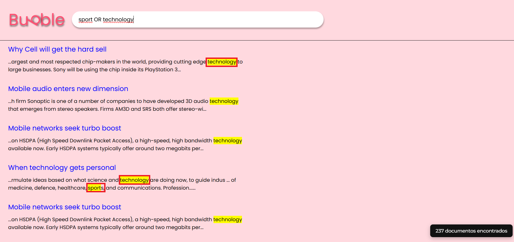

# Relatório: Trabalho Prático 1 – Manipulação de sequências
## Integrantes:
Bruna Santos - 2023028242  
Ian Godoi - 2022093024

## 1. Introdução
O trabalho propõe a construção de uma máquina de busca compacta sobre o corpus BBC News. O trabalho entregue integra uma API em Flask, responsável pela indexação e consulta dos documentos, a uma interface web apelidada de Bubble, produzindo uma experiência única de autocomplete, paginação e destaque de termos. O objetivo principal é aplicar os conhecimentos acerca de árvores de prefixo para construção de índices invertidos, além de fixar o conteúdo ensinado em sala de aula e mostrar sua aplicabilidade em contextos práticos mais realistas. O trabalho também se propõe a instigar o aluno a entrar em contato com linguagens e ferramentas que não são usualmente cobradas ou discutidas no percurso curricular vigente.

O sistema foi dividido em três módulos principais: o módulo de estrutura de dados, responsável pela implementação da Trie compacta; o módulo de indexação, encarregado da leitura e processamento dos documentos e da construção do índice invertido; e o módulo de recuperação, responsável por interpretar consultas booleanas e calcular a relevância dos documentos retornados. Por fim, a aplicação web construída em Flask e HTML fornece uma interface de busca simples, que simula o comportamento de uma máquina de busca tradicional. A união desses componentes permitiu a construção de um sistema capaz de indexar diversos textos e responder consultas compostas por operadores lógicos com resultados relevantes e contextualizados.

## 2. Metodologia
A metodologia adotada para o desenvolvimento do trabalho seguiu uma abordagem modular, em que cada componente foi construído, testado e validado de forma independente antes da integração final. Inicialmente, foi projetada a estrutura de dados Trie, na forma de uma árvore de prefixos compactada. Sendo essa a estrutura requisitada pelo enunciado do trabalho, cujas capacidades envolvem: eficiência na representação e recuperação de cadeias de caracteres, permitindo economizar memória ao compartilhar prefixos comuns entre palavras. A Trie compacta é composta por nós que armazenam prefixos e mantêm referências para seus filhos, possibilitando buscas, inserções e sugestões de autocompletar de forma rápida.

A etapa seguinte consistiu na construção do módulo de indexação, responsável por percorrer o corpus de documentos, tokenizar o conteúdo de cada arquivo e inserir os termos obtidos na Trie compacta, cuja estrutura armazena internamente o índice invertido dos documentos e suas frequências. Esse índice associa cada termo aos documentos nos quais ele aparece, armazenando também a frequência relativa do termo em cada documento. Ao término da indexação, foram calculadas estatísticas descritivas de cada termo, como a média e o desvio padrão das frequências, valores posteriormente utilizados para o cálculo dos z-scores durante a fase de busca.

Em seguida, foi desenvolvido o módulo de recuperação de informação, que recebe uma consulta textual e interpreta sua estrutura lógica. As consultas podem conter operadores booleanos AND, OR e parênteses, além de suportar a ausência explícita de operadores, caso em que o sistema interpreta implicitamente como conjunções AND. Após a análise sintática da consulta, o módulo recupera os documentos correspondentes a cada termo e combina os resultados conforme a expressão lógica definida. Finalmente, para determinar a relevância dos resultados, o sistema calcula a média dos z-scores dos termos da consulta, permitindo ordenar os documentos de modo que os mais significativos apareçam primeiro. É importante ressaltar que, Embora um dicionário seja mantido em memória para cálculo de estatísticas e exportação do índice, a estrutura central utilizada durante a busca é a Trie compacta, que armazena referências diretas aos documentos.”

Por fim, o sistema foi integrado a uma interface web simples, composta pelo arquivo index.html, que carrega um ambiente Angular responsável pela renderização dinâmica dos resultados de busca. O backend Flask conecta os módulos de indexação e recuperação ao front-end, possibilitando a interação do usuário com o mecanismo de busca por meio de uma interface gráfica responsiva.

## 3. Decisões de Projeto
Durante o desenvolvimento, diversas decisões de projeto foram tomadas visando a clareza estrutural e a eficiência de execução. Sendo a primeira delas a leitura direta do corpus via ZipFile, com o objetivo de reduzir o consumo de disco. Durante o desenvolvimento, foi inicialmente utilizado um dicionário em Python para validar o comportamento do índice invertido. Posteriormente, essa estrutura foi incorporada à Trie compacta, de modo que cada nó terminal da árvore passou a armazenar os documentos e frequências associados ao termo. Essa estrutura permitiu realizar operações de interseção e união entre conjuntos de documentos de forma rápida, o que é essencial para a avaliação de consultas booleanas. Optou-se ainda por incluir no índice os parâmetros estatísticos de média e desvio padrão para cada termo, viabilizando o cálculo de relevância por meio de normalização z-score. Essa técnica assegura que termos muito frequentes não dominem o ranking de resultados, equilibrando a importância relativa entre documentos longos e curtos.

No processamento das consultas, foi escolhida uma abordagem baseada em pilhas para a avaliação das expressões booleanas. Essa escolha simplifica a implementação e garante a correta precedência entre os operadores AND e OR, além de permitir o uso de parênteses aninhados. Para o cálculo da relevância, empregou-se uma média logarítmica dos z-scores, suavizando diferenças extremas entre documentos e evitando a concentração de pontuações elevadas em textos que contenham repetições intensas de um mesmo termo. Para tratamento de palavras com hífen, foi decido considerá-las como uma string inteira, por tanto, elas são sugeridas apenas pelo prefixo, ou seja, o hífen foi considerado como caractere da palavra.

Em relação à interface, priorizou-se a compatibilidade e o carregamento eficiente. O arquivo index.html inclui apenas um CSS global mínimo e carrega o bundle principal de JavaScript, onde estão contidos os estilos e scripts específicos do componente. Essa decisão evita sobrecarga de recursos estáticos e torna a aplicação mais leve, ao custo de exigir que o bundle seja carregado corretamente para que o design completo seja exibido. Além de que o frontend foi concebido como um build Angular desacoplado que consome rotas JSON, exibe o campo de busca com estética neomórfica, executa animações com Three.js e administra a paginação. Para permitir evoluções futuras com clientes hospedados em domínios distintos, o servidor ativa CORS por meio de flask-cors.

## 4. Implementação
O arquivo `app.py` é o ponto de partida da aplicação: ele inicia o servidor Flask, habilita a comunicação com o navegador e define as rotas que conectam o site à lógica interna do sistema. Quando o programa é executado, ele realiza a indexação inicial dos documentos, processando até duzentos arquivos por padrão — valor que pode ser ajustado conforme necessário. A classe Indexador, no arquivo `core/indexer.py`, é responsável por contar as ocorrências das palavras, calcular estatísticas e interagir com a estrutura da Trie, além de oferecer funções para salvar e carregar o índice. O módulo `core/retriever.py `interpreta as consultas feitas pelo usuário, combina os resultados conforme os operadores lógicos (AND e OR) e calcula a relevância de cada documento. A Trie compacta, implementada em `core/trie.py`, é a estrutura que organiza os termos de forma eficiente, permitindo buscas rápidas e sugestões automáticas. O site é exibido a partir do arquivo `index.html`, que carrega o design e as animações desenvolvidas com JavaScript e `Three.js`. Já o arquivo `indice_invertido.txt` armazena o índice criado durante a indexação e garante que, nas próximas execuções, o sistema possa ser carregado rapidamente sem precisar reprocessar todos os textos. Por fim, todas as dependências do projeto estão listadas em `requirements.txt` e foram testadas em um ambiente Python 3.12 configurado na pasta virtual `.venv`.

## 5. Exemplos de Uso
Para verificar o funcionamento do sistema, foram realizados diversos testes com o corpus da BBC. Inicialmente, após a indexação, a Trie compacta foi inspecionada por meio de inserções de teste, confirmando que prefixos comuns eram devidamente agrupados. Por exemplo, a inserção das palavras “batata” e “batalha” resultou em um nó compartilhado com prefixo “bata”, demonstrando a eficácia da compactação. Consultas de autocompletar, como “ba”, retornaram corretamente sugestões de termos como “batata” e “batalha”, validando o funcionamento do método sugestoes.

I.`(economy AND government)`

II. `(sport OR technology)`

III. `(economy AND government) OR sports`

IV. `finance market`

V. `(economy AND (market OR inflation)) OR (economy AND government)`

VI. As sugestões aparecem para todos os termos de busca

Os resultados foram ordenados por relevância, exibindo em primeiro lugar os textos com maior densidade relativa dos termos pesquisados. No navegador, a interface de busca permitiu digitar consultas e visualizar os resultados paginados, com dez documentos por página. Cada resultado apresentava um trecho de 160 caracteres do texto original, contendo o termo de busca destacado. Essa funcionalidade foi implementada de forma a reproduzir a experiência típica de um mecanismo de busca, permitindo ao usuário avaliar rapidamente o contexto da ocorrência.

## 6. Conclusões
O desenvolvimento do Trabalho Prático 1 permitiu compreender de forma prática como estruturas de dados clássicas podem ser aplicadas em sistemas reais de recuperação de informação. A implementação da Trie compacta demonstrou a importância de otimizar a representação de strings em memória, reduzindo redundâncias e melhorando o tempo de busca. O índice invertido mostrou-se eficiente para relacionar termos e documentos, e o cálculo de relevância com base em z-scores forneceu uma métrica estatística consistente para a ordenação dos resultados.

Em suma, o trabalho alcançou seu objetivo principal de aplicar conceitos teóricos de algoritmos e estruturas de dados à construção de uma aplicação completa, consolidando o aprendizado sobre manipulação de sequências, árvores de prefixo e recuperação de informação, ao mesmo tempo em que proporcionou uma experiência prática de integração entre backend e front-end em um ambiente de desenvolvimento web moderno.

## Referências
Radix tree. Disponível em: <https://en.wikipedia.org/wiki/Radix_tree>.

JAMIEGO. Data Structures in Golang - The trie data structure. Disponível em: <https://www.youtube.com/watch?v=H-6-8_p88r0>. Acesso em: 19 out. 2025.
‌
INSIDE CODE. Trie data structure - Inside code. Disponível em: <https://www.youtube.com/watch?v=qA8l8TAMyig>. Acesso em: 19 out. 2025.

Compressed Tries. Disponível em: <https://www.tutorialspoint.com/data_structures_algorithms/compressed_tries.htm>. Acesso em: 19 out. 2025.

‌COMPUTERBREAD. Compressed trie. Disponível em: <https://www.youtube.com/watch?v=qakGXuOW1S8>. Acesso em: 19 out. 2025.
